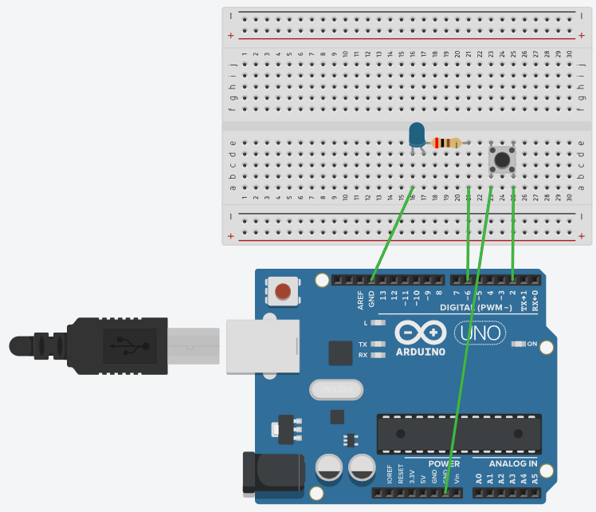

# Projet Authenticator

## Introduction

L'**Authenticator** est un système embarqué conçu pour gérer des credentials sécurisés via une interface UART et un stockage en EEPROM. Il permet à
l’utilisateur de s’authentifier auprès d’un ensemble de services (appelés Relying Parties) à travers
un Client (souvent un navigateur web).

---

## Schéma électrique




## Compilation et téléversement

### Étapes pour compiler et téléverser le programme :
1. **Compilation :**
   - Pour compiler le projet, utilisez la commande suivante :
     ```bash
     make
     ```
2. **Téléversement :**
   - Si vous êtes sur Linux/Windows :
     ```bash
     make upload
     ```
   - Si vous êtes sur Mac :
     Modifiez la ligne 3 du `Makefile` pour y indiquer le port correct (par exemple `/dev/tty.usbmodemXXXX`), puis exécutez :
     ```bash
     make upload MAC=1
     ```

---

## Fonctionnalités implémentées

- **Génération de clés** :
  - Utilisation de la bibliothèque `uECC` pour générer des paires de clés publiques et privées basées sur la courbe elliptique `secp160r1`.
  
- **Stockage en EEPROM** :
  - Les credentials et les clés sont stockés de manière persistante dans la mémoire EEPROM sous la structure `Credential`.

- **Authentification via UART** :
  - Gestion des commandes UART pour créer de nouveaux credentials, récupérer des assertions, et lister les credentials stockés.

- **Réinitialisation** :
  - Fonction de réinitialisation permettant d'effacer toutes les données stockées dans l'EEPROM après une validation utilisateur.

---

## Choix techniques

### 1. **Utilisation de `micro-ecc`**
Nous avons opté pour la branche **static** de la bibliothèque `micro-ecc` car elle permet une optimisation des calculs cryptographiques grâce à des pré-calculs réalisés à la compilation. Cela réduit considérablement le temps d'exécution sur des microcontrôleurs à ressources limitées.

### 2. **Gestion de l'EEPROM**

Les données des utilisateurs sont stockées dans l'EEPROM à l'aide d'une structure appelée `Credential`, qui contient :

- **`app_id`** : Identifiant unique de l'application (20 octets, SHA-1 hash).
- **`credential_id`** : Identifiant du credential (16 octets).
- **`private_key`** : Clé privée utilisée pour signer les données (21 octets).

#### Capacité mémoire

Dans le cadre de l'Atmega328p Rev3, l'EEPROM a une taille de 1 Ko, soit 1024 octets disponibles. Pour optimiser l'espace et permettre des recherches efficaces, nous avons décidé de stocker :

- Les triplets `app_id`, `credential_id`, et `private_key` (57 octets par entrée).
- Un compteur représentant le nombre de triplets actuellement en mémoire.

#### Calcul de la capacité maximale

Le nombre maximal de clés pouvant être stockées est donné par la formule :  
**Capacité maximale = 1024 / 57 ≈ 17.96**  

Nous retenons uniquement la partie entière pour éviter tout dépassement de mémoire, soit un maximum de **17 clés**.

### 3. **Génération de nombres pseudo-aléatoires**
Nous avons opté pour la fonction standard `rand` de `stdlib`, initialisée avec une **seed** dérivée des valeurs de l'ADC.

### 4. **Gestion du BaudRate**
Plutôt que de calculer manuellement le registre UBRR pour la configuration du baud rate, nous avons utilisé la bibliothèque `util/setbaud.h`, qui ajuste automatiquement les valeurs en fonction de la fréquence d'horloge et du baud rate désiré.

---

## Difficultés rencontrées

### 1. **Génération de nombres aléatoires**
Nous avons initialement tenté d'utiliser le Mersenne Twister, un générateur pseudo-aléatoire performant et suffisant pour la sécurité de la courbe `secp160r1`. Cependant, son intégration causait des conflits avec la fonction uECC_make_key de la bibliothèque uECC (nous n'avons pas pu trouver la source de l'erreur).
Nous avons donc opté pour `rand()` de stdlib.h, initialisé avec une seed obtenue via l'ADC (convertisseur analogique-numérique). En configurant le prescaler à 128, nous avons amélioré l'entropie des valeurs générées, garantissant une qualité adaptée à notre application.

### 2. **BaudRate instable**
En utilisant la même formule que dans les travaux pratiques précédents, les valeurs lues/ecrites avec l'UART étaient incohérentes. Ce problème a été corrigé avec l'utilisation du fichier `util/setbaud.h` pour configurer le baud rate du périphérique UART.

### 3. **Gestion des app_id**
Cette partie ne traite pas une difficulté, mais plutôt un manque de complétude des tests. Les tests étaient limités par le fait que le client utilisait une app_id fixe, ce qui empêchait de tester plusieurs applications en parallèle, et donc de tester un peu plus en profondeur la gestion de notre mémoire non volatile.

### 4. **Utilisation initiale de `ring_buffer`**
Au départ, nous avons tenté d’utiliser la bibliothèque `ring_buffer` fournie, mais nous rencontrions des difficultés à la faire fonctionner correctement. En approfondissant, nous avons constaté que les octets étaient transmis assez lentement par le client. Cela permettait de traiter les données sans avoir besoin d’un mécanisme de gestion de buffer. Nous avons donc décidé de nous en passer.

---

## Tests réalisés

### 1. **Tests fonctionnels**
- **Commande MakeCredential** : Test de la génération de clés avec différents app_id.
- **Commande GetAssertion** : Vérification de la signature des données client avec les clés correspondantes.
- **Commande ListCredentials** : Vérification de l'extraction des credentials stockés dans l'EEPROM.
- **Commande Reset** : Test de la réinitialisation complète de l'EEPROM.

### 2. **Tests de robustesse**
- Simulation de pertes de communication UART pour vérifier la stabilité.
